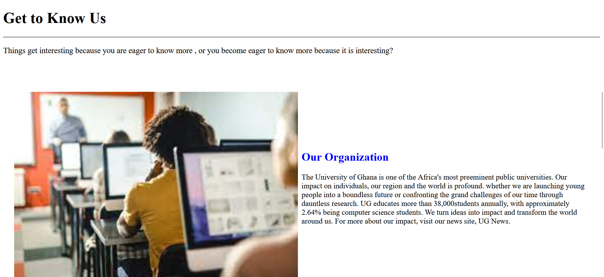
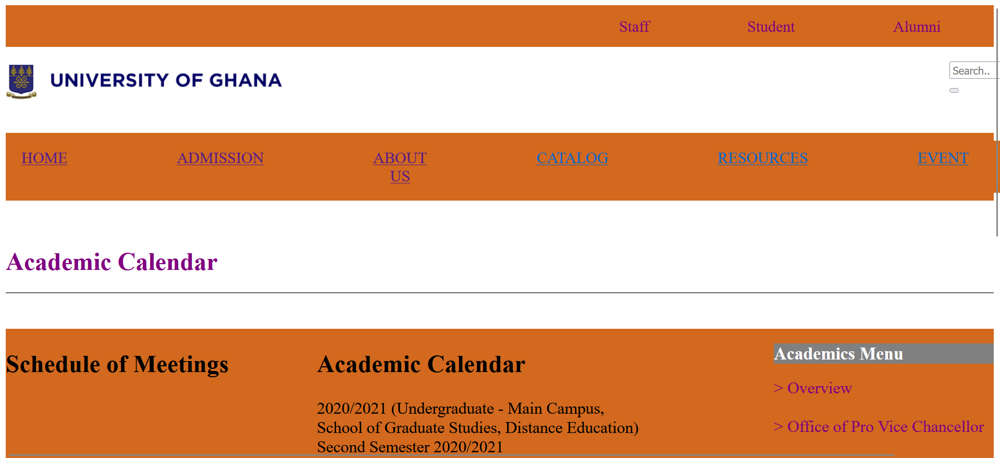
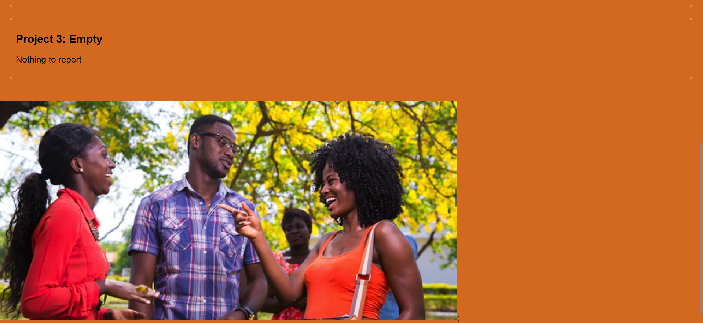

# DCIT_205_IA

Name: Ashong Kelvin Kweku Siaw
ID: 11296303

Welcome to the Computer Science Department Website! This website is made up of key features such as the Faculty, how to contact the department,
events; both past and upcoming, how to get admission into the university and many more. It also gives a brief clone of the academic calendar of
the department. 
Whether you are interested in pursuing a degree or conducting researches our department is committed in helping you do so. This website gives people
the chance to know about the department. It also gives people access to resources designed to support your ambitions and also provides people with an
option to contact the department if there are any confusions or enquiries to be made.

Welcome to the home page of our computer Science Department.

Get to  know all about us in our about page.

Discover various ways to get into the department and how to apply for them.

Learn more about courses offered in this Department.

Need enquiries? Just visit our contact webpage to give us a call or send us a mail.

At the end of the project, i became familiar with tags and css styles. I learnt to create a well-
organized contents. During the coding, i was able to solve problems I encountered easily after each 
completed page. I learnt some git commands and how to operate them with git. I also got to know about 
github.

